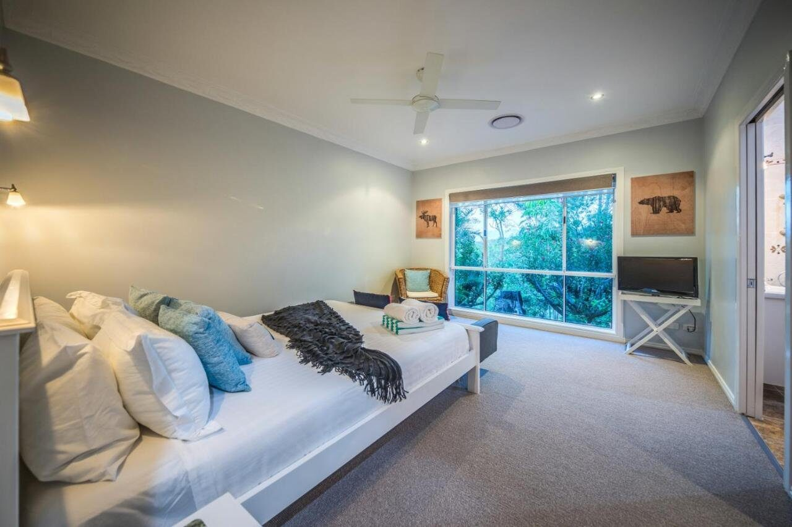

Hillside House is our spacious family home at The Hillside Retreat, on the eastern slopes of Tamborine Mountain, looking out over the valley to the Gold Coast and the coastline beyond. The view runs the full length of the house.

Inside, the open-plan lounge and dining area sits beside a brand new fully fitted kitchen, so whoever is cooking is never cut off from the conversation or the view. The master bedroom has an ensuite shower room and a large walk-in wardrobe, and every bedroom has air-conditioning and an overhead fan. There's a well-equipped laundry with washer, dryer, iron and ironing board, so you can stay fresh and wrinkle-free throughout your visit.

The large wraparound verandah, with ample seating and a gas BBQ, is the spot for dining al fresco while the sun goes down over the valley. Level with the verandah, the newly renovated inground pool and heated spa (shared facilities) come with sun loungers and a view of the coastline.

Arriving by electric vehicle? Our on-site 7.3 kW Type 2 charger means you can spend the day exploring the mountain's wineries and waterfalls and wake to a fully charged car.

Tamborine Mountain's wineries, walking tracks and waterfalls are a few minutes' drive away, and Surfers Paradise is 30 minutes down the mountain. In winter, light the wood burning fireplace and settle in for the evening.

> “Facilities are very well maintained and the house is very cozy and well furnished. Definitely a great choice for family getaway, and it comes with an amazing view for sunrise too!”
>
> — Cassandra, Malaysia

[Book with us](/book/?room_rate=413447)

## Accommodation comprises

- Large fully fitted kitchen with Oven, Hob, Microwave, Dishwasher & Coffee Machine. Kettle, Toaster, utensils, cutlery, crockery and a large pantry, so you can cook for the whole group.
- Open plan dining area.
- Spacious open plan lounge with 60” flat screen TV with Netflix.
- Wood burning fireplace.
- Master Bedroom with Queen Bed, Ensuite Shower Room, large walk-in wardrobe and TV.
- Second Queen bedroom.
- Twin bedroom.
- All bedrooms with overhead fans and air-conditioning.
- Family Bathroom with bath and separate shower.
- Bed linen and towels supplied.
- Laundry room with washer, dryer, ironing board and iron.
- Large wraparound verandah with ample seating and breathtaking coastal views of the Gold Coast and beyond.
- Newly renovated inground pool and heated spa (shared facilities).
- Sun loungers and pool seating (shared facilities).
- Wi-Fi throughout the property.
- EV charging on site (7.3 kW, Type 2). Fully recharges most vehicles overnight.
- Free private parking on site.

## More ways to stay

## Just the two of you?

Our self-contained 1-bedroom Hillside Villa, with its own private entry, courtyard, and fireplace, is perfectly sized for a couple's escape.

[See Hillside Villa](/hillside-villa/)

## Need room for more than 6?

Book the House and Villa together, connected as one retreat sleeping up to 8, with exclusive use of the pool and spa.

[About House & Villa](/house-and-villa/)

## A look around

