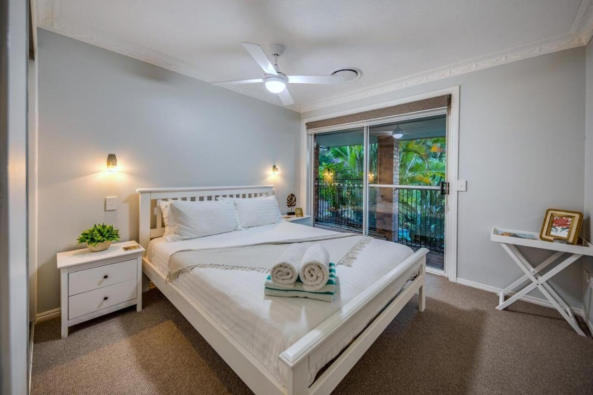

For larger groups and families, we're delighted to offer [Hillside House](/hillside-house/) and [Hillside Villa](/hillside-villa/), our two dwellings at The Hillside Retreat on Tamborine Mountain, as a combined booking. A connecting door joins the two accommodations, opening them up into one retreat with the whole property to yourselves.

The House carries the shared living, with meals around the big table, evenings by the fire and the verandah for everyone. The Villa is a self-contained space for grandparents, couples, or anyone who appreciates their own quiet corner. Whether it's a family reunion, a milestone celebration, or a getaway with friends, everyone can be together without being on top of each other.

A combined booking also gives you exclusive use of the pool and heated spa, with no other guests sharing them for the length of your stay.

The retreat makes an easy base for the mountain's wineries, waterfalls and walking trails, or for staying put and watching the light change over the coastline from the verandah.

> “Amazing place. full size house. outdoors spaces fantastic with views to die for. Pool and spa very clean, House beautifully furnished and clean. Owner very friendly and knowledgeable. Koala in the tree.”
>
> — Maria, New Zealand

This combination can only be booked directly with us, so we can confirm availability of both properties and tailor the stay to your group. Contact us at [stay@thehillside.com.au](mailto:stay@thehillside.com.au?subject=Enquiry%3A%20Hillside%20Retreat) or on [0466 990 185](tel:+61466990185), and we'll be delighted to help with availability, pricing, and any special requests.

## Accommodation comprises

- Two self-contained accommodations joined by a connecting door, so everyone can share meals together and still have their own space to retreat to.
- Large fully fitted House kitchen with Oven, Hob, Microwave, Dishwasher, Coffee Machine and large pantry.
- Open plan dining area and spacious lounge with 60” flat screen TV with Netflix.
- Wood burning fireplaces in both House and Villa.
- Master Bedroom with Queen Bed, Ensuite Shower Room, large walk-in wardrobe and TV.
- Second Queen bedroom and Twin bedroom in the House.
- Family Bathroom with bath and separate shower.
- Villa with its own private entrance, courtyard, lounge, well equipped kitchenette, Queen bedroom and shower room. Ideal for grandparents or a couple who'd like their own quiet corner.
- All bedrooms with overhead fans and air-conditioning.
- Bed linen, towels and toiletries supplied throughout.
- Laundry room with washer, dryer, ironing board and iron.
- Large wraparound verandah with ample seating and breathtaking coastal views of the Gold Coast and beyond.
- Gas BBQ for al fresco dining.
- Exclusive use of the newly renovated inground pool and heated spa.
- Sun loungers and pool seating.
- Wi-Fi throughout the property.
- EV charging on site (7.3 kW, Type 2). Fully recharges most vehicles overnight.
- Free private parking on site.

## More ways to stay

## Not needing the Villa?

Our spacious 3-bedroom Hillside House sleeps up to 6, with a full kitchen, wraparound verandah, and those famous coastal views.

[See Hillside House](/hillside-house/)

## Just the two of you?

Our self-contained 1-bedroom Hillside Villa, with its own private entry, courtyard, and fireplace, is perfectly sized for a couple's escape.

[See Hillside Villa](/hillside-villa/)

## A look around

